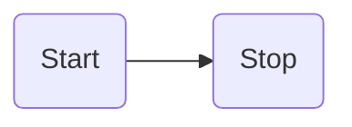

<!-- Navigation top -->
[__`home`__][home] [__`seiten`__][seiten] [__`a-z`__][content] [__`<--`__][left] [__`hoch`__][up] [__`-->`__][right] [__`runter`__][bottom] _`home/github/mermaid`_

<!-- Navigation links -->
[home]:    ./home
[seiten]:  ./wiki-pages
[content]: ./wiki-content-az
[left]:    ./wiki-github
[up]:      ./home
[right]:   ./wiki-github
[top]:     #
[bottom]:  #links

<!-- CONTENT START ############################################## -->

## Mermaid

#### Flowcharts - Basic Syntax

["Flowcharts - Basic Syntax"](https://mermaid.js.org/syntax/flowchart.html)



<!-- Content navigation -->
[](#) [](#) [](#)

<!-- ToDos -->
<!-- 
-->

<!--
### CHAPTER

#### SUBCHAPTER
-->

<!-- Program code -->
<!--
```swift
// Programmcode
```
-->

<!-- CONTENT END ############################################## -->

<!-- Comment [__`rauf`__][top] [__`runter`__][bottom] -->

<!-- Links --> <br>
##### Links:
<!--   
[`doku`](, "Apple Dokumentation")
[`buch`](, "Swift.org Buch")
[`"TEXT"`](LINK) _<sub>`by AUTHOR, YEAR`</sub>_
-->

<!---
##### Videos:
[`"TEXT"`](LINK) _<sub>`by AUTHOR, YEAR, Xmin`</sub>_
--->

<!-- Navigation bottom --> <br>
<!-- ###### <sub>_</sub> Ersatz Sprungmarke, wenn keine Links -->
[__`home`__][home] [__`seiten`__][seiten] [__`a-z`__][content] [__`<--`__][left] [__`hoch`__][up] [__`-->`__][right] [__`rauf`__][top]