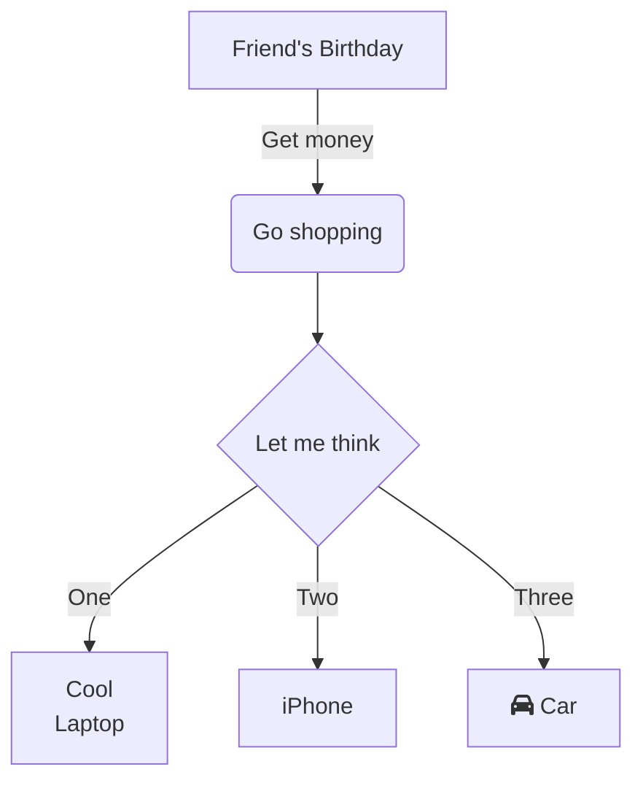
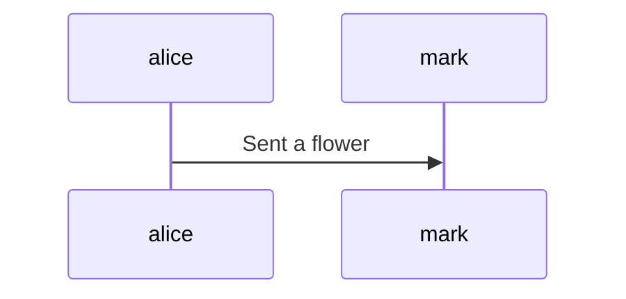
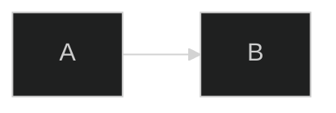

<!-- Navigation top -->
[__`home`__][home] [__`seiten`__][seiten] [__`a-z`__][content] [__`<--`__][left] [__`hoch`__][up] [__`-->`__][right] [__`runter`__][bottom] _`home/allgemein/github`_

<!-- Navigation links -->
[home]:    ./home
[seiten]:  ./home-pages
[content]: ./home-az
[left]:    ./wiki-literature
[up]:      ./home-wiki
[right]:   ./wiki-xxx
[top]:     #
[bottom]:  #links

<!-- CONTENT START ############################################## -->
## GitHub

#### Github
[`Anleitung`](https://docs.github.com/de/get-started "get started") 

#### Markdown
[`GitHub`](https://docs.github.com/de/get-started/writing-on-github "writing on github") 
[`Cheatsheet`](https://github.com/adam-p/markdown-here/wiki/Markdown-Cheatsheet) 
[`J.Gruber`](https://daringfireball.net/projects/markdown)

[]() []() []() 


---
#### Link:   
[Gründau](https://www.google.de/maps/@50.2035717,9.1065082,14z?entry=ttu)

[`link`]()

[link][1]

[1]: http://slashdot.org

---
#### Code:
```swift
let name: String = "volker"

```

---
#### Graph:
https://mermaid.js.org/intro

[mermaid](https://docs.github.com/en/repositories/working-with-files/using-files/working-with-non-code-files#displaying-mermaid-files-on-github) [mermaidEditor](https://mermaid.live/edit#pako:eNpVjstqw0AMRX9FaNVC_ANeFBq7zSbQQrPzZCFsOTMk80CWCcH2v3ccb1qtxD3nCk3Yxo6xxP4W760lUTjVJkCe96ay4gb1NJyhKN7mAyv4GPgxw_7lEGGwMSUXLq-bv18lqKbjqjGodeG6bKh69r8Cz1A3R0oa0_kvOd3jDB-N-7b5_H9ihXPrs-mp7KloSaAieSq4Q8_iyXX5_WlNDKplzwbLvHYkV4MmLNmjUePPI7RYqoy8wzF1pFw7ugj5LVx-AfLqVWg) [home](https://mermaid.js.org) [Beispiele](https://gist.github.com/ChristopherA/bffddfdf7b1502215e44cec9fb766dfd)




%%{init: { 'theme':'dark', 'sequence': {'useMaxWidth':false} } }%%





--- 
#### Map:

Using [geoJSON](https://docs.github.com/en/get-started/writing-on-github/working-with-advanced-formatting/creating-diagrams#creating-geojson-and-topojson-maps)

```geojson
{
  "type": "FeatureCollection",
  "features": [
    {
      "type": "Feature",
      "id": 1,
      "properties": {
        "ID": 0
      },
      "geometry": {
        "type": "Polygon",
        "coordinates": [
          [
              [-90,35],
              [-90,30],
              [-85,30],
              [-85,35],
              [-90,35]
          ]
        ]
      }
    }
  ]
}
```

Using [topoJSON](https://docs.github.com/en/get-started/writing-on-github/working-with-advanced-formatting/creating-diagrams#creating-geojson-and-topojson-maps)
```topojson
{
  "type": "Topology",
  "transform": {
    "scale": [0.0005000500050005, 0.00010001000100010001],
    "translate": [100, 0]
  },
  "objects": {
    "example": {
      "type": "GeometryCollection",
      "geometries": [
        {
          "type": "Point",
          "properties": {"prop0": "value0"},
          "coordinates": [4000, 5000]
        },
        {
          "type": "LineString",
          "properties": {"prop0": "value0", "prop1": 0},
          "arcs": [0]
        },
        {
          "type": "Polygon",
          "properties": {"prop0": "value0",
            "prop1": {"this": "that"}
          },
          "arcs": [[1]]
        }
      ]
    }
  },
  "arcs": [[[4000, 0], [1999, 9999], [2000, -9999], [2000, 9999]],[[0, 0], [0, 9999], [2000, 0], [0, -9999], [-2000, 0]]]
}
```

---
#### 3D-Modelle

```stl
solid cube_corner
  facet normal 0.0 -1.0 0.0
    outer loop
      vertex 0.0 0.0 0.0
      vertex 1.0 0.0 0.0
      vertex 0.0 0.0 1.0
    endloop
  endfacet
  facet normal 0.0 0.0 -1.0
    outer loop
      vertex 0.0 0.0 0.0
      vertex 0.0 1.0 0.0
      vertex 1.0 0.0 0.0
    endloop
  endfacet
  facet normal -1.0 0.0 0.0
    outer loop
      vertex 0.0 0.0 0.0
      vertex 0.0 0.0 1.0
      vertex 0.0 1.0 0.0
    endloop
  endfacet
  facet normal 0.577 0.577 0.577
    outer loop
      vertex 1.0 0.0 0.0
      vertex 0.0 1.0 0.0
      vertex 0.0 0.0 1.0
    endloop
  endfacet
endsolid
```

---
#### Einzug
<details>
<summary>Einzug</summary>

Text der eingezogen ist.
    
<details>
<summary>Einzug 2a</summary>

Zweiter Text der eingezogen ist.
</details>
    
<details>
<summary>Einzug 2b</summary>

Zweiter Text der eingezogen ist.
</details>

... und weiter im Text.
</details>

---
#### Tabelle:
| default-aligned | Left-aligned | Center-aligned | Right-aligned | 
| ---             | :---         | :---:          | ---:          | 
| git status      | git status   | git status     | git status    | 
| git diff        | git diff     | git diff       | git diff      |

```
| default-aligned | Left-aligned | Center-aligned | Right-aligned | 
| ---             | :---         | :---:          | ---:          | 
| git status      | git status   | git status     | git status    | 
| git diff        | git diff     | git diff       | git diff      |
```
---
#### Kommentar:
<!-- Unsichtbater Kommentar -->

---
#### Emojis:

:+1: 😧 🇩🇪 🐱 [Emoji-Liste](https://github.com/ikatyang/emoji-cheat-sheet/blob/master/README.md)

---
#### Fussnote:

Here is a simple footnote[^1].

A footnote can also have multiple lines[^2].

[^1]: My reference.
[^2]: To add line breaks within a footnote, prefix new lines with 2 spaces.
  This is a second line.

Farbiger Text
${\color{red}Roter \ Text!}$ 😟
```
${\color{red}Roter \ Text!}$
```

<!-- CONTENT END ############################################## -->

<!-- [__`rauf`__][top] [__`runter`__][bottom] -->

<!-- Links --><br>
##### Links:   
[`docu`]( ## "Apple Dokumentation")
[`book`]( ## "Swift.org Buch")
[]() []()

##### Videos:
[]() []()

<!-- Navigation bottom --><br>
[__`home`__][home] [__`seiten`__][seiten] [__`a-z`__][content] [__`<--`__][left] [__`hoch`__][up] [__`-->`__][right] [__`rauf`__][top]